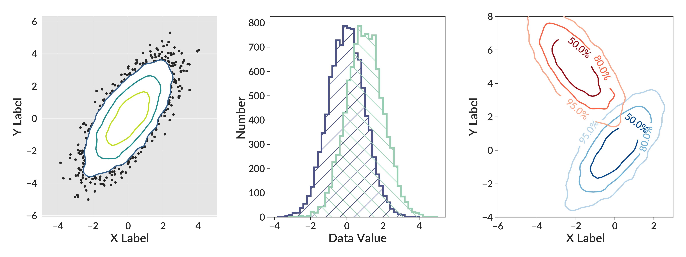

.. betterplotlib documentation master file, created by
   sphinx-quickstart on Fri Aug 14 06:53:50 2015.
   You can adapt this file completely to your liking, but it should at least
   contain the root `toctree` directive.

.. currentmodule:: betterplotlib

betterplotlib
===========================================

Betterplotlib is a Python library that is designed to make plotting with matplotlib
easier, and results in prettier plots. It isn't a replacement for either matplotlib
itself or other packages like Seaborn. Betterplotlib adds some sugar behind the scenes
to make the default matplotlib plots look much nicer, and adds some convenience functions
to make some tricky things much easier. You can use the exact same syntax with
betterplotlib as you can with matplotlib, making it a very easy package to use if
you're familiar with matplotlib.

Installation
------------

The package is available in PyPI, so you can install with `pip install betterplotlib`.

Documentation
-------------

The full documentation of the API is available through these two pages.

.. toctree::
   :maxdepth: 1

   api_overview
   style

.. Indices and tables
.. ==================

.. * :ref:`genindex`
.. * :ref:`modindex`
.. * :ref:`search`

