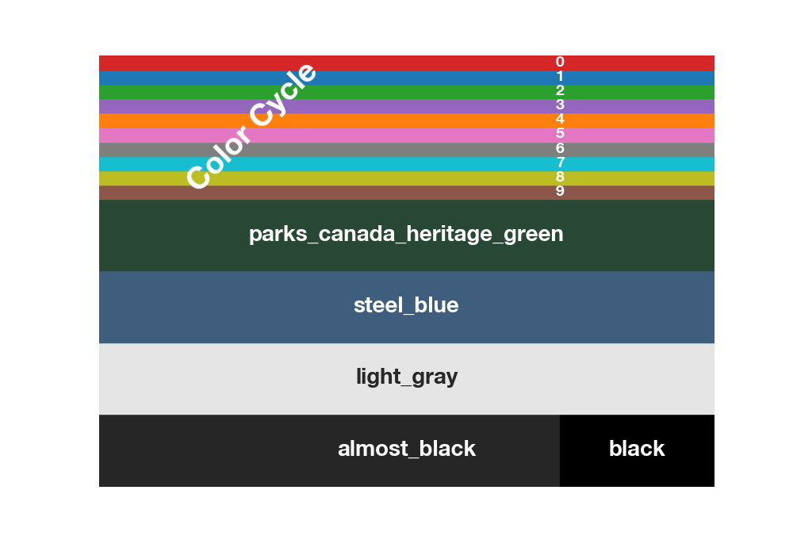

.. currentmodule:: betterplotlib

.. _styles_api:

Style and Colors
==================================

Betterplotlib has multiple style options that make plots look better in 
general. These are all accessed through `bpl.set_style()`. The default style is the
best choice for everyday usage. `bpl.set_style("white")`, makes lines white, so they
are visible against a dark background in a presentation, and `bpl.set_style("latex)"`
uses LateX for font rendering.

The general best practice is to call the style once at the beginning of the
file or notebook, right after the imports. 

.. autofunction:: set_style

Colors
------

Betterplotlib has some additional colors that have been defined. In particular, the
color cycle is set to a custom set. Some other colors are ones I have
found and liked. `parks_canada_heritage_green` is the color of the road signs in the
Candaian National Parks, which I really liked. `steel_blue` is a nice dark blue color.
`light_gray` is what it sounds like, and it used for the dark axes. `almost_black` is
just what it sounds like, and is used as the default black throughout the plots to
make them slightly easier on the eyes. Here are all those defined colors.

There are also some functions to help out with managing colors and colorbars.

.. autofunction:: create_mappable
.. autofunction:: fade_color
.. autofunction:: unfade_color