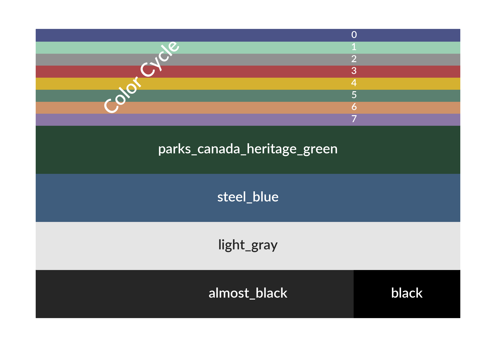

.. currentmodule:: betterplotlib

.. _styles_api:

Styles
==================================

Betterplotlib has multiple style options that make plots look better in 
general. `default_style()` is the best choice for everyday usage. 
`presentation_style()` makes font larger for easily readable presentations.
`white_style()` also makes the text larger, but also makes lines white, so they
are visible against a dark background in a presentation.

The general best practice is to call the style once at the beginning of the
file or notebook, right after the imports. 

The following table shows which parameters are set in which style.

Font Options
---------------

+--------------------+------------+---------------+-------+
| Parameter          | Default    | Presentation  | White |
+====================+============+===============+=======+ 
| `font.family`      | sans-serif                         |
+--------------------+------------+---------------+-------+
| `font.sans-serif`  | Helvetica Neue                     |
+--------------------+------------+---------------+-------+
| `font.weight`      | bold                               |
+--------------------+------------+---------------+-------+
| `axes.labelweight` | bold                               |
+--------------------+------------+---------------+-------+
| `axes.titleweight` | bold                               |
+--------------------+------------+---------------+-------+
| `axes.titlesize`   | 16         | 22                    |
+--------------------+------------+---------------+-------+
| `font.size`        | 14         | 20                    |
+--------------------+            |                       +
| `axes.labelsize`   |            |                       |
+--------------------+------------+---------------+-------+
| `xtick.labelsize`  | 12         | 16                    |
+--------------------+            |                       +
| `ytick.labelsize`  |            |                       |
+--------------------+------------+---------------+-------+
| `legend.fontsize`  | 13         | 18                    |
+--------------------+------------+---------------+-------+
| `text.color`       | bpl.almost_black           | white |
+--------------------+------------+---------------+-------+

Colors
------

+--------------------+------------+---------------+-----------------------------------------+
| Parameter          | Default    | Presentation  | White                                   |
+====================+============+===============+=========================================+ 
| `patch.edgecolor`  | bpl.almost_black           | white                                   |
+--------------------+                            |                                         +
| `axes.edgecolor`   |                            |                                         |
+--------------------+                            |                                         +
| `axes.labelcolor`  |                            |                                         |
+--------------------+                            |                                         +
| `xtick.color`      |                            |                                         |
+--------------------+                            |                                         +
| `xtick.color`      |                            |                                         |
+--------------------+                            |                                         +
| `grid.color`       |                            |                                         |
+--------------------+------------+---------------+-----------------------------------------+
| color cycle        | Modified Tableau 10        | white, yellow, then Modified Tableau 10 |
+--------------------+------------+---------------+-----------------------------------------+
| `image.cmap`       | Viridis                                                              |
+--------------------+------------+---------------+-----------------------------------------+

Other
-----

These other parameters are constant for all styles.

+----------------------------+---------+
| Parameter                  | Value   |
+============================+=========+ 
| `legend.scatterpoints`     | 1       |
+----------------------------+---------+
| `savefig.format`           | pdf     |
+----------------------------+---------+
| `axes.formatter.useoffset` | False   |
+----------------------------+---------+
| `figure.figsize`           | [10, 7] |
+----------------------------+---------+

API
---

The following show the ways to set each style. 

.. autofunction:: default_style

.. autofunction:: presentation_style

.. autofunction:: white_style

Colors
------

Betterplotlib has some additional colors that have been defined. The color cycles comes from the [Pallettable](https://jiffyclub.github.io/palettable/tableau/) library. I used the Tableau 10 color cycle with the order modified. Some other colors are ones I have found and liked. `parks_canada_heritage_green` is the color of the road signs in the Candaian National Parks, which I really liked. `steel_blue` is a nice dark blue color. `light_gray` is what it sounds like, and it used for the dark axes. `almost_black` is just what it sounds like, and is used as the default black throughout the plots to make them slightly easier on the eyes. Here are all those defined colors.

